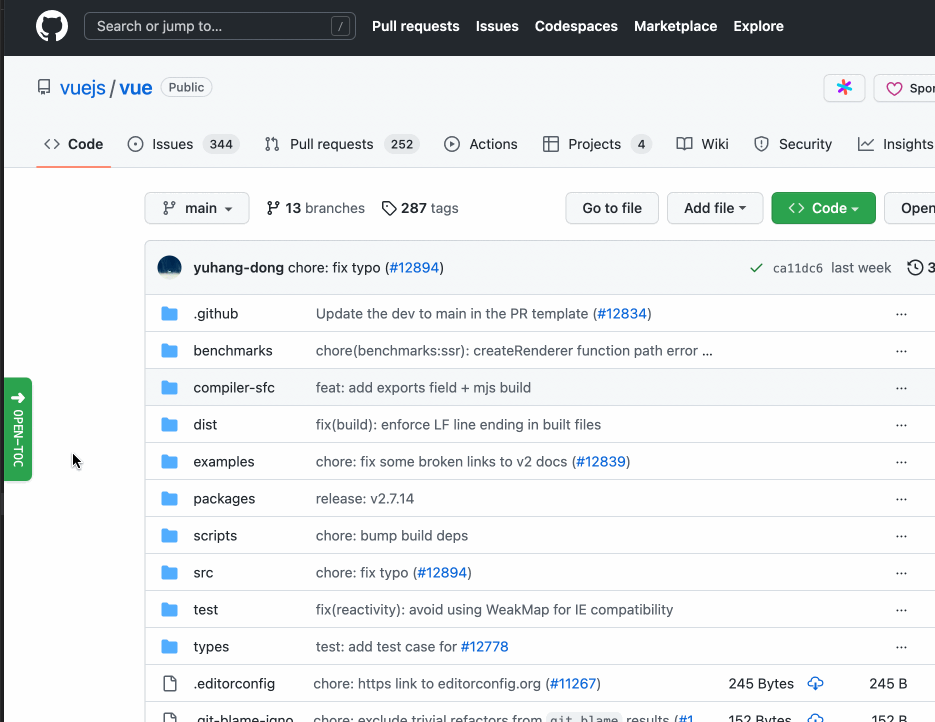

# Github-md-Toc

这是一款 chrome 扩展，支持对 GitHub 上的markdown进行解析，生成侧边栏TOC目录

## Features

- 支持 wiki
- 支持展开收起

## Install

- [chrome Store](https://chrome.google.com/webstore/detail/github-markdown-toc/pfhlmojplmconbbfhhbacdeeblepmilm/related)
